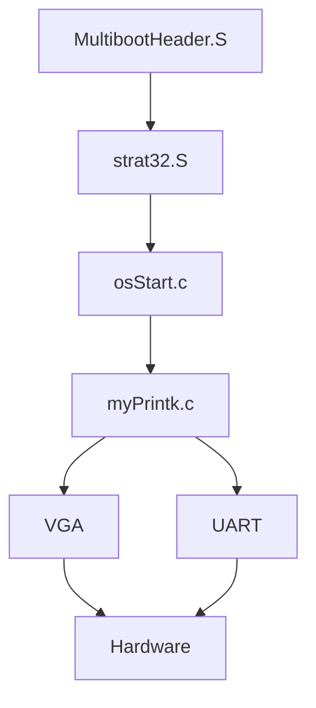
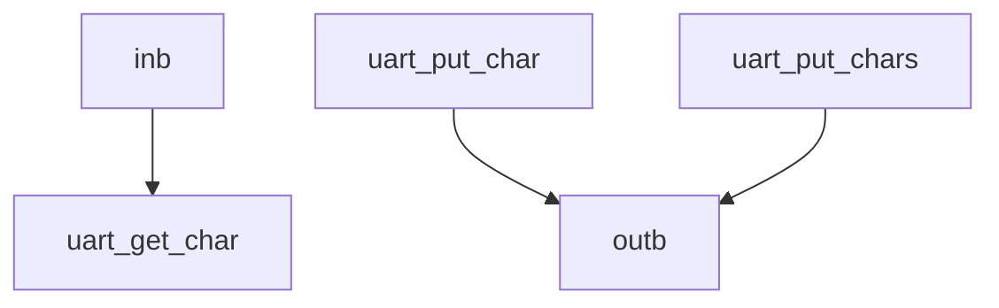
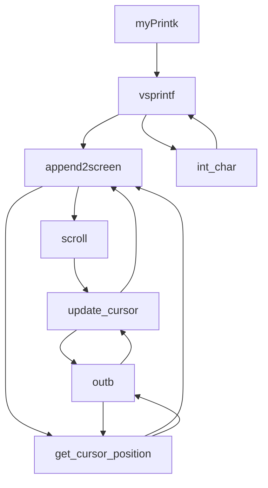

<center><font size = "6"><b>OS lab2 report

<center><font size = "4">刘祥辉 PB21051012

#### 一、软件的框图




#### 二、主流程

MultibootHearder.S:

```
.globl start

MAGIC = 0x1BADB002 # we use version 0.6.96 not version 2 (magic = 0xe85250d6)
FLAGS = 0
CHECKSUM = 0xE4524FFE   #(magic + checksum + flags should equal 0)

.section ".multiboot_header"
.align 4
  .long MAGIC
  .long FLAGS
  .long CHECKSUM

.text
.code32
start:
  call _start
  hlt  
```

注意到验证MultibootHearder头协议后，进入_start标识的函数。

start32.C

```
STACK_SIZE =	0x1000	# Size of heap and stack. 4KB

/* ===== code32 =========================== */

	.globl 	_start		# GNU default entry point
	.globl 	osStart
.text
.code32
_start:
	jmp establish_stack

dead:	jmp dead			# Never here

# Set up the stack
establish_stack:
#省略了

# Zero out the BSS segment
zero_bss:
#省略了

# Transfer control to main
to_main:	
	call	osStart

shut_down:	
	jmp	shut_down	# Never here	

/* ===== data =========================== */

```

_start建立了栈空间，zero_bss清空了bss端，接着进入osStart标识段。

osStart.c:

```
extern int myPrintk(int color,const char *format, ...);
extern void clear_screen(void);
extern void myMain(void);

void osStart(void){
	clear_screen();
	myPrintk(0x2,"START RUNNING......\n");
	myMain();
	myPrintk(0x2, "STOP RUNNING......ShutDown\n");
	while(1);
}

```

操作系统启动先执行清屏函数，随后打印开始运行的字符串，接着调用myMain()进入用户程序，用户程序执行完毕后打印结束字符串，随后执行无限循环等待手动结束程序。

main.c:

```c
extern int myPrintf(int color,const char *format, ...);
extern int myPrintk(int color,const char *format, ...);

void myMain(void){    
    int i;
	myPrintk(0x7,"main\n");
	for (i=1;i<30;i++) myPrintf(i,"%d\n",i);
	return;
}
```

系统调用myPrintk函数进行输出字符和颜色信息

```MERMAID
graph TD
A[MultiboorHeader.S]
B[start32.S]
C[osStart.c]
D[clear_Screen]
E[myPrintk.c]
F[myMain.c]
G[myPrintk.c]
H[while1]
I[inb]
J[outb]
A-->B
B-->C
C-->D
D-->E
E-->F
F-->G
G-->H
D-->J
E-->J
F-->J
G-->J
I-->E
I-->F
I-->G
```


#### 三、主要功能模块及其实现

uart.c:

```c
extern unsigned char inb(unsigned short int port_from);
extern void outb (unsigned short int port_to, unsigned char value);

#define uart_base 0x3F8

void uart_put_char(unsigned char c){
	outb(uart_base,c);
	return;
}
unsigned char uart_get_char(void){
	return inb(uart_base);         
}
void uart_put_chars(char *str){ 
	while(*(str)){
		outb(uart_base,*str);
		str++;
	}
	outb(uart_base,'\0');
	return;
}
```

调用inb,outb函数完成串口输入输出字符，字符串



vga.c:

```
void update_cursor(void){//通过当前行值cur_cline与列值cur_column回写光标
	//use global variable cur_line and cur_column tp update the current cursor position
	short cur_pos;
	cur_pos = 80*cur_line + cur_column;
	//here, we will use the inb and outb to interact with port = 0x3D4 and port = 0x3D5 
	outb(0x3D4,0x0E);
	outb(0x3D5,(cur_pos>>8)&0x00FF);  //高八位
	outb(0x3D4,0x0F);		
	outb(0x3D5,(cur_pos)&0x00FF);	 //低八位
	return;
}
```

当我们往port=0x3D4送0x0F后，我们与port=0x3D5交互的就是这个一维偏移量低8bit的数据。当我们往port=0x3D4送0x0E后，我们与port=0x3D5交互的就是这个一维偏移量高8bit的数据。  

```
  int get_cursor_position(void){//获得当前光标，计算出cur_line和cur_column的值
	 int high_pos, low_pos,cur_pos;
	outb(0x3D4,0x0E);
	high_pos = inb(0x3D5);
	outb(0x3D4,0x0F);
	low_pos  = inb(0x3D5);
	cur_pos  = (low_pos&0x00FF)|((high_pos<<8)&0xFF00);
	cur_line = cur_pos / 80;
	cur_column   = cur_pos - cur_line*80; 
	return cur_pos;
}
```

同样的通过向port=0x3D4发送数据,在port=0x3D5接受数据，然后计算当前行、列的位置

```
void clear_screen() {   //清屏
	char space = ' ';
	int i;
	for(i=0; i<25*80; i++)
		*(vga_init_p + i) = ( short )(((0xFF << 8) & 0xff00) | space);
	cur_line = 0;
	cur_column = 0;
	update_cursor();
	return;
}
```

清屏函数向端口初址加上偏移量发送空格即可，然后置行列均为0，调用update_cursor()回写光标。

```
void scroll(int color) {    //滚屏
	int i,j;
	char space = ' ';
	for(i=0;i<24;i++)
		for(j=0;j<80;j++)
			*(vga_init_p+2*(i*80+j)) = *(vga_init_p+2*((i+1)*80+j));
	for(i=24,j=0;j<80;j++)
		*(vga_init_p + 2*(i*80 + j)) =  ((color << 8) & 0xff00) | space;
	cur_column = 0;
	cur_line   = 24;
	update_cursor();
	return;
}
```

滚屏函数将整体内容向上平移一行，将最末行清零，并将光标置为最末行首列。

```C
void append2screen(char *str,int color){ 
	short *p;
	short pos;
	while(*str){
		if(*str == '\n'){
			if(cur_line >= 24)
				scroll(color);
			else {
				cur_line += 1;
				cur_column = 0;
				update_cursor();
			}
			str++;
		}
		else{
			pos = get_cursor_position();
			p = vga_init_p + 2*pos;
			*p = ((color<<8)&0xFF00)|(*str);
			cur_column +=1;
			update_cursor();
			if(cur_line >= 25)
				scroll(color);
			str++;
		}
	}
	return;
}
```

遇到换行符则移动光标位置进行换行，到达最末行最末列则进行滚屏操作。

```c
int myPrintk(int color,const char *format, ...){
int myPrintf(int color,const char *format, ...){
```

函数运行时会调用

```c
void append2screen(char *str,int color);
int vsprintf(char *buf, const char *fmt, va_list argptr);
```

vsprintf调用的时候又会调用

```c
void int_char(char*str, int num)
```

这个函数作用是将数字转化为字符显示。例如short 型整数num存储的数字"16"转换为char型存储的'1'6'
vsprintf函数将字符格式化输出，目前只完成了%d的输出，其他待开发。

流程图：



#### 四、代码布局说明（地址空间）

- MultibootHeader起始地址为	a1=1M
- 其中的.text部分起始地址为          a2=a1+sizeof(MultibootHeader)补足至8字节对齐
- .data部分为                                    a3=a2+sizeof(text)补足至16字节对齐
- .bss部分为                                      a4=__bss_start=a3+sizeof(data)补足至16字节对齐
- 操作系统结束位置为_end，地址为__bss_end补足至16字节对齐

#### 五、编译过程说明

终端中输入./source2run.sh执行脚本文件
编译的大致过程：第一步，编译各个文件，生成相应的 .o 目标文件；第二步，根据链接描述文件，将各 .o 目标文件进行链接，生成 myOS.elf 文件。

#### 六、运行结果说明


#### 问题及解决方案

最初向指定内存写入数据是pos没有乘二

`p =(short*)( vga_init_p + pos);`

导致出现的结果很奇怪，后来发现写入字符是两个字节的修改为

`p =(short*)( vga_init_p + 2*pos);`即可